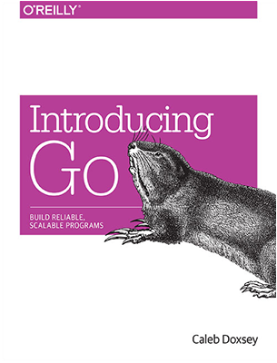

  

<h1 align="center">Introducing Go</h1>

Build Reliable, Scalable Programs

## Book Description

Perfect for beginners familiar with programming basics, this hands-on guide provides an easy introduction to Go, the general-purpose programming language from Google.

## About the Author

Caleb Doxsey is a developer in New York City who enjoys helping new programmers learn Go. He works as a Software Engineer at DataDog building monitoring software for the cloud.
